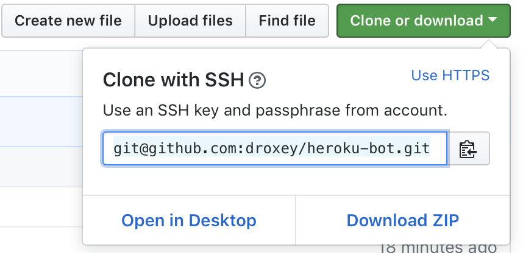

# How To: Bot Deployment via Heroku

## Purpose

This guide provides a simple to follow, **step by step process** that focuses on:

- **Deploying bots**, written in **Python**
- on **[Heroku](https://www.heroku.com/)**
- **without exposing** any **secrets** (_example: API keys_)
- using only the **command line**.

## Step by Step Guide

1. **Fork** [this repository](https://github.com/outputs-io/heroku-bot) to get started.

    

1. GitHub will redirect you to your new fork. Click the green `Clone or download` button to retreive the **SSH url** of your freshly forked repository. Select the address, and copy it to your clipboard.

    

1. **Open Terminal**, **navigate** to the directory you store your code, and  **clone** your new repository to your local machine.

    _Example_:

    ```bash
    cd ~/dev/repos
    git clone git@github.com:outputs-io/heroku-bot.git
    ```

1. **Install requirements** from `requirements.txt`:

    ```bash
    cd heroku-bot
    source activate PythonData
    pip install -r requirements.txt
    ```

1. **Create Heroku App**

    Run `heroku apps:create` to create a new Heroku application, replacing `name-for-app-here` with a name of your choosing:

    ```bash
    heroku apps:create name-for-app-here
    ```

1. **Add Environment Variables**

    Next, we need to **keep our secret data safe**. API keys, database passwords, and other credentials should **never** be committed to git, nor pushed to GitHub.

    Open the `.env.sample` file in your repository, and paste your keys into the placeholders provided. Once complete, run `mv .env.sample .env` in your terminal to rename the file to `.env`.  Don't worry, `.env` is already in `.gitignore` --- this means secrets are only visible to you, and to Heroku upon deployment.

1. **Implement Bot**: open `ChatterBot.py` in your favorite editor, and write your code. Don't forget to test!

1. **Commit Your Changes Incrementally**

    **_Great developers commit early and often!_**

    Be sure to `add` and `commit` your changes to your local git repository **each time** you reach a milestone, fix a bug, or need to take a break.

    ```bash
    git add .
    git commit -m "[fix] typo in quote on line 28."
    ```

1. **Push Your Changes to GitHub**

    Ready to take your changes live? Awesome!

    Let's double check you've committed all your changes by running the following command:

    ```bash
    git status
    ```

    If `git status` returns a list of files, `add`, `commit`, then run `git status` again.

    If `git status` returns `nothing to commit, working tree clean`, excellent! You're ready to push your changes to GitHub:

    ```bash
    git push origin master
    ```

1. **Deploy to Heroku**

    Finally, run the below command to **deploy** your application to Heroku.

    ```bash
    git push origin heroku
    ```

    _**Protip**: be sure to **read the output**. This will come in handy if you run into any errors!_

1. **_Congratulations!_** You've just successfully deployed your application! Show the world!
